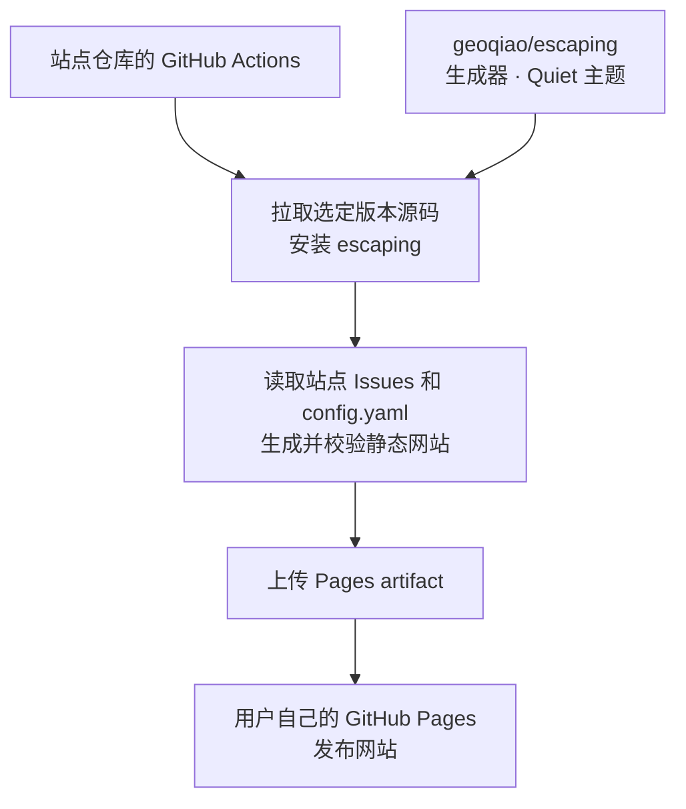
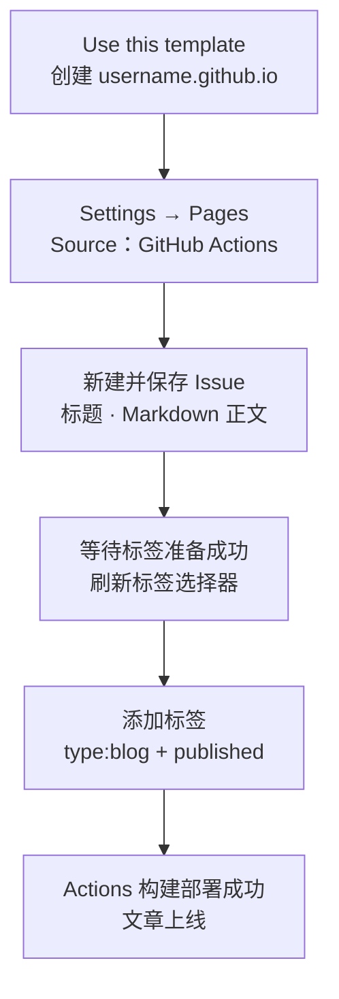

> “**People Die, but Long Live GitHub**” -- [gitblog](https://github.com/yihong0618/gitblog)

# Escaping 🚀

[Escaping](https://github.com/geoqiao/escaping) 是一个极致简洁、自动化程度极高的个人博客框架。它将 GitHub Issues 作为后端编辑器，利用 GitHub Actions 自动触发构建，并最终通过 GitHub Pages 进行分发。

**核心特性**：

- 📝 **以 Issue 为博文**：直接在 GitHub Issues 中写作，支持标签分类。
- 🤖 **全自动化流**：无需本地部署，已发布 Issue 更新后自动构建。
- 🎨 **优雅 UI**：内置 Quiet 主题，支持暗色模式，也支持自定义本地主题。
- 🔍 **SEO 友好**：自动生成 `sitemap.xml`、`robots.txt` 以及语义化的 URL (Slugs)。
- ⚡ **自动构建**：基于 Python 和 `uv`，由 GitHub Actions 完成安装、构建和部署。

---

## 工作原理

生成器仓库维护代码和主题，站点仓库保存文章、配置和部署流程。构建在用户自己的站点仓库里运行，拉取选定版本的 escaping 源码并安装。生成的网页直接交给 GitHub Pages，不推回 `main`。

---

## 如何使用

1. **创建仓库**：打开 [escaping-template](https://github.com/geoqiao/escaping-template)，点击 **Use this template**，创建公开仓库 `username.github.io`（将 `username` 换成你的 GitHub 用户名），保持 Issues 和 Actions 开启。
2. **配置 Pages**：进入 **Settings → Pages**，Source 选择 **GitHub Actions**。无需安装 Python 或配置 PAT。
3. **写文章**：新建 Issue，填写标题和 Markdown 正文并保存。等待 Actions 中的 **Prepare missing labels only** 成功，再刷新 Issue 的标签选择器。
4. **发布文章**：添加 `type:blog` 和 `published` 标签，查看 Actions，部署成功后文章上线。

站点信息可按需修改 `config.yaml`，不改也能开始。编辑已发布 Issue 可更新文章；移除 `published` 可撤稿，均在下一次成功构建后生效。关闭 Issue 不会撤稿。更多设置见[模板说明](https://github.com/geoqiao/escaping/blob/main/starter/README.md)。

> 模板仍是公开预览：现有站点部署已验证，新用户初始化流程尚未完整验证。

---

## 致谢

本项目深受以下优秀项目的启发：

- [gitblog](https://github.com/yihong0618/gitblog) - 用 GitHub Issues 写博客。
- [Gmeek](https://github.com/Meekdai/Gmeek) - 提供了极简的构建思路。

## 最后

去年 11 月搬家，新出租屋离地铁站远了不少。电瓶车充电麻烦，于是买了辆二手自行车代步。

提车第二天早上，本来只想骑到地铁站。结果手脚不受控制，满脑子兴奋，直接骑到公司了——真的很解压。

这辆二手自行车是捷安特的 Escape 1 ，也是项目名字 Escaping 的由来。

---

_Tags: [#blog](https://github.com/geoqiao/geoqiao.github.io/issues/new#blog) [#github](https://github.com/geoqiao/geoqiao.github.io/issues/new#github) [#python](https://github.com/geoqiao/geoqiao.github.io/issues/new#python) [#escaping](https://github.com/geoqiao/geoqiao.github.io/issues/new#escaping) [#escape](https://github.com/geoqiao/geoqiao.github.io/issues/new#escape)_
