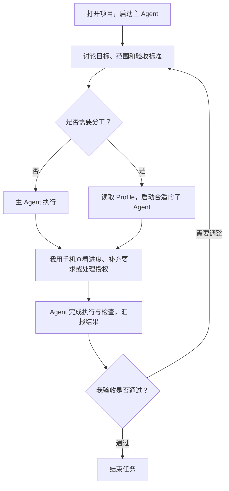

距离选择 paseo 作为 agent-desktop-app 已经 1 个月了，我再也没有打开过 cursor 或者 codex。

> codex 定义了过去 desktop agent APP 的最佳实践，但是 Paseo 正在定义未来

Paseo 同时拥有：
1. codex desktop 优雅强大的功能设计
2. PI code agent 简洁高效的 harness  & 多 Provider 的兼容
3. Herdr 管理多 agent 的面板
4. 极致丝滑的移动端远程体验

这篇接着[六款桌面 Agent 工具的选择记录](https://geoqiao.me/blog/agent-orchestrator-desktop-selection/)往下写：上一篇解释为什么选 Paseo，这篇记录选定之后怎么用。更早的 [Pi + Herdr + Neovim 终端组合](https://geoqiao.me/blog/terminal-codex-workflow-with-pi-and-herdr/)则是这次迁移的起点。

## How Paseo works
### The Userinterface

> Paseo = codex  +  Herdr + VSCode

 像在 VSCode 中随意拖动 Multi-agent 的视窗布局，随时打开编辑器阅读代码。并且同时兼具 codex-like 的 agent native UI 风格：

### The agent-profile (Subagent)

依托 agent-profile，主会话可以根据任务场景调起不同 subagent 完成任务，即使这些 agent 来自不同的 harness 。

我按任务职责分档，不是每个任务都要走一遍：主 Agent 负责讨论和把关；查资料交给只读整理，边界清楚的任务交给执行实现，复杂问题交给复杂实现。重要结论再请另一套 harness 下的 Agent 独立复核，减少同一种思路的盲点。

### Other features

1. 内置 browser 、完成预览标记修改
2. 支持 39+ agent： Claude code、codex、pi、grok、cursor、Hermes....
3. 非常丝滑从来没有出现过断连的 mobile APP 远程体验

## How I use 

只需要打开 Settings -> agent -> enable paseo tools , 然后开始任务：

## The END

cursor 和 codex 虽然也很强大，但是没有办法像 Herdr 那样自由布局 Tab 和 panel。Herdr 虽好用，但是对于我这种非 coding 背景的用户来说，还是太难操作了。

Paseo 把 worktree、Herdr/tmux、tailscale 这些技术概念隐藏幕后，同时提供了 codex-like 的友好前端，非常值得一试。

下面是我做的几个 Pi 扩展（非必须）：

| 工具        | 用途                                  | 链接                                                                                                                                       |
| --------- | ----------------------------------- | ---------------------------------------------------------------------------------------------------------------------------------------- |
| pi-ask    | 支持 RPC 模式，让 Pi 在 Paseo 中使用原生交互式提问。  | [安装](https://pi.dev/packages/@geoqiao/pi-ask?name=pi-ask) · [项目](https://github.com/geoqiao/pi-tools/tree/main/packages/pi-ask)                                      |
| paseo-btw | 类似 Herdr BTW，在 Paseo 中打开独立面板进行旁支对话。 | [安装](https://pi.dev/packages/@geoqiao/paseo-btw?name=paseo-btw) · [项目](https://github.com/geoqiao/pi-tools/tree/main/packages/paseo-btw) |
| pi-usage  | 汇总本机多种 Agent 工具的使用量。                | [安装](https://pi.dev/packages/@geoqiao/pi-usage?name=pi-usage) · [项目](https://github.com/geoqiao/pi-tools/tree/main/packages/pi-usage)    |
