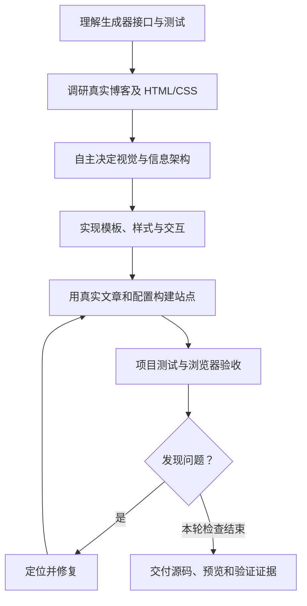
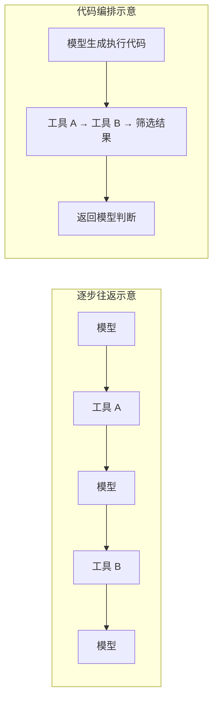

> **在Long-Running 任务中，PI + Code Mode 对比原生工具，累计 token 减少 75%，固定单价估算费用降低 64%；而 PI + 原生工具的 token 消耗是前者的 4 倍，账单消耗是前者的 3 倍。**

## 1. 背景

GPT 6 Astra 发布后，我以自己的个人博客项目为例，做了三组对比：**Codex + GPT 6 Astra、Pi + GPT 6 Astra，以及 Claude Code + Opus 5**。三组的推理档位都设为 High。

我的原意，是看看同一个 Astra 放在不同 Harness 中有什么区别，以及它和 Opus 5 谁更擅长完成一个真实的前端任务。

但统计执行数据时，最吸引我的不是最终设计，而是 token 账单：

| 组合 | 主题作品 | 已记录累计 token | 执行耗时 |
|---|---|---:|---:|
| Codex + GPT 6 Astra | Waymark | **5,868,074** | 26 分 49 秒 |
| Pi + GPT 6 Astra | Estuary | **17,167,770** | 54 分 07 秒 |
| Claude Code + Opus 5 | Folio | **32,271,458** | 32 分 13 秒 |

Pi 的累计 token 是 Codex 的 **2.93 倍**。从保留下来的截图和交付记录看，我没有看到与这个消耗差距相称的视觉提升。

这和我此前从公开评测中形成的印象不太一样：Pi 是一个极简的架构，各种评测几乎总是平衡效果与成本的第一名。

**为什么到了我的项目里，结果反过来了？**

## 2. 这不是“帮我生成一个首页”的简单任务

我的博客由自己维护的 Escaping 生成器构建。任务不是输出一张好看的首页截图，而是为现有生成器独立设计并实现一个完整主题。

Agent 可以读取接口和测试，调研真实的个人博客网站。主题名、布局、字体、配色和交互，都由它自己决定。

## 3. 贵的可能不是写代码，而是一遍遍读取上下文

看见上千万 token，我的第一反应是：**统计是不是算错了？**

于是我们回到原始日志，统一执行范围、按响应去重，并用独立脚本、Pi 原生统计和 Vibe Usage 交叉核对。

这里最容易忽略的是：**累计 token 不等于模型读过的独有内容。**

假设一次模型响应携带 10 万 token 的输入，连续发生 100 次，仅累计输入就可能达到 1,000 万 token。它不意味着任务有 1,000 万 token 的新材料，更不意味着这些历史内容每次都被完整重新计算。

缓存命中会让历史输入便宜一些，但不会让缓存读取从用量和费用中消失。

这次原生 Pi 有 **129 次普通非零模型响应**， Codex 是 **40 次**。两者总 token 差额中，约 **99% 来自缓存读取差额**。

这解释了账面上发生的事：Pi 在这次执行中，更多次带着已有上下文回到模型。

Codex 的 40 次 tool calls ，并没有少做什么，而是利用 OpenAI 的原生 Code Mode ，将多步工具调用整合到一次 exec 调用中。这使得 tool call 的次数大大减少，而每次 tool call 返回结果后，都会带着历史上下文重新当做模型的输入，尽管其中 99% 可以命中缓存。

## 4. 加入 Code Mode 后，发生了什么？

Code Mode 的思路，是
1. 只暴露 exec 和 wait 两个工具，减少暴露噪音，
2. 模型只能选择在 exec 中用代码编排工具调用

这极大减少了逐次调用产生的： tool call -> thinking -> tool call 的循环，这就减少了每次 tool call 的 result 携带的大量历史上下文反复请求模型

我随后新增了一组 Pi 实验：使用 `pi-codex-conversion` 的 Code Mode，用相同的提示词，从相同代码基线出发。

结果很明显：累计 token 减少了 75%，Cost 减少了 64%！

| 指标           |  Pi + 原生工具 | Pi + Code Mode |         变化 |
| ------------ | ---------: | -------------: | ---------: |
| 普通非零模型响应     |        129 |             42 | **−67.4%** |
| 每次普通响应平均完整输入 |    132,069 |        101,222 | **−23.4%** |
| 缓存读取 token   | 16,667,520 |      3,992,448 | **−76.0%** |
| 累计 token     | 17,167,770 |      4,294,726 | **−75.0%** |
| 执行耗时         |  54 分 07 秒 |      32 分 33 秒 | **−39.9%** |
| 固定单价估算费用     |     $24.29 |          $8.75 | **−64.0%** |

合理，Code Mode 中模型响应更少，每次平均携带的输入也更少，累计读取自然随之下降。旧、新 Pi 的 token 差额中，**98.46% 来自缓存读取减少**。

## 5. 那些“Pi 最便宜”的评测错了吗？

### Databricks：真实代码库中的模型 × Harness 比较

Databricks 在内部真实 PR 任务上发现，Pi 在同模型、同推理强度的部分对比中，以相近质量把任务成本降到原生 Harness 的一半以下：

*图：Databricks 原文 Figure 1，来自 [Benchmarking Coding Agents on Databricks’ Multi-Million Line Codebase](https://www.databricks.com/blog/benchmarking-coding-agents-databricks-multi-million-line-codebase)，2026-07-08。*

### Maka：89 道终端任务的 Harness 比较

我们核对了 [Maka PR #3004](https://github.com/apache/maka/pull/3004)。它比较九个 Harness，使用相同的 **DeepSeek V4 Flash / max reasoning**，在 Terminal-Bench 2.1 的 **89 道终端任务**上，用官方 verifier 验收。

其中相关的结论是：Pi 确实更便宜，摊到每道通过题的费用也更低；Codex 则多通过了 7 题

| Harness |  通过任务 | 累计 token |  估算总费用 |  总费用／通过数 |
| ------- | ----: | -------: | -----: | -------: |
| Pi      | 66/89 |  131.40M | $1.303 | $0.01974 |
| Codex   | 73/89 |  259.62M | $2.105 | $0.02883 |

这里我猜测，Code Mode 在一些短任务上，tool call 调用并不复杂，由于每次调用 exec 后，还需要再单独写 JS ，所以成本反而没有优势

## 6. 64% 很有吸引力，但还不是因果结论

本次实验的一些限制：

| 限制       | 这次实际发生的情况                                       |
| -------- | ----------------------------------------------- |
| 样本只有一个任务 | 四个实验组，只分别执行了一次相同的任务；                            |
| 质量没有统一评分 | 第四组 Pi + Code Mode 开始任务时，实际上项目已经发生变化，虽然提示词限制了版本 |

目前成立的是：**Code Mode 在这个真实长流程任务中，明显降低了已记录用量和估算费用。**

## 总结：Code Mode 是未来吗？

**对工具密集、需要多轮读取与验证的长流程任务，我认为 Code Mode 是一个值得继续使用和验证的方向。真正值得追问的不是 Agent 能连续工作多久，而是：有多少次模型往返，本来可以不用发生？**

还有一些有趣的猜想：
1. 逻辑上 Bash 也可以完成类似 Code Mode 的编排能力，但是由于其他 tool 的暴露干扰 、缺少 Code Mode 的 harness 调教，所以实际效果比 Code Mode 差
2. 实验组不约而同的使用了侧边导航栏的布局
3. GPT 6 在三组测试中的 UI 风格几乎一致
4. 三个测试组在调研博客时，Web Search 到的结果重叠率很高，应该有很多值得学习的 SEO、GEO 技巧

## 关联阅读

- [我如何使用 Paseo](https://geoqiao.me/blog/how-i-use-paseo/)

## 参考资料

- [Databricks：模型与 Harness 交叉评测](https://www.databricks.com/blog/benchmarking-coding-agents-databricks-multi-million-line-codebase)。
- [Maka：九种 Harness 的 Terminal-Bench 2.1 对比](https://github.com/apache/maka/pull/3004)。

## 附录：本次测试的四组最终成果对比

*图：本次测试保留的四组完整首页截图，按相同列宽缩放、未裁剪。*
