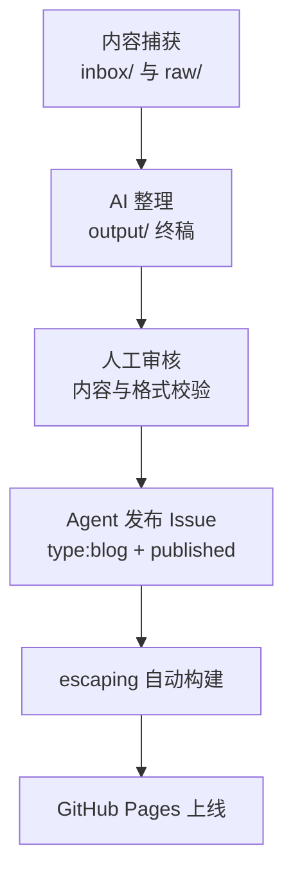
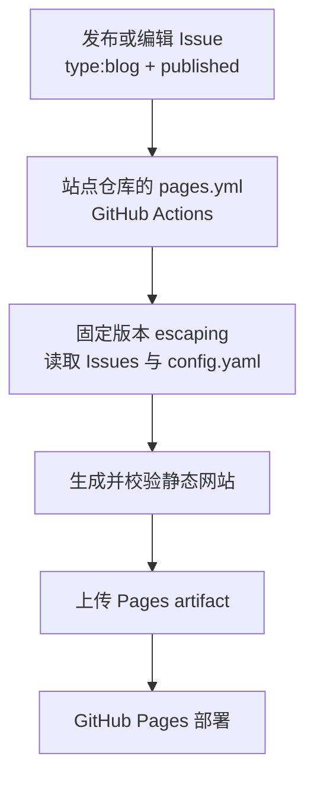

# 从 Obsidian 到博客：我如何用一条命令把笔记变成网站

> **TL;DR**：我在 Obsidian 里写完文章，对 AI 说"发出去"，博客就自动更新了。

---

## 我的困境

我用 Obsidian 做本地知识库已经两年了。它完美满足了我对写作工具的所有要求：本地优先、Markdown 语法、双向链接、标签系统、跨设备同步。

但有一个问题始终没解决：**Obsidian 里的内容只能自己看**。

每次想发博客，我都得：
1. 在 Obsidian 里写完
2. 打开 GitHub Issues
3. 复制粘贴正文
4. 手动调整格式（去掉 YAML frontmatter、处理 wikilink）
5. 重新打一遍标签
6. 发布

这套操作不复杂，但很烦。尤其是我在用的博客基于 [Escaping](https://github.com/geoqiao/escaping) 框架——一个我自己维护的、以 GitHub Issues 为内容源的静态博客系统。每次发布都要去 Issues 里手动操作，和 Obsidian 的写作体验形成了鲜明对比。

## 方案：让 AI 当桥梁

今天我终于打通了这个工作流。核心思路很简单：



**Obsidian 负责内容生产，AI 负责整理与发布，我负责审核把关。**

## 各层拆解

### 第一层：Obsidian —— 内容的源头

我的 Obsidian Vault 不是简单的笔记堆积，而是一个遵循 [Karpathy's LLM Wiki pattern](https://gist.github.com/karpathy/442a6bf555914893e9891c11519de94f) 的内容生产流水线：

| 目录 | 分工 |
| --- | --- |
| `inbox/` | 待办与灵感 |
| `raw/` | 原始素材，按 TODO 分组 |
| `wiki/` | LLM 维护的结构化知识 |
| `output/` | 终稿，从草稿到发布后归档 |

每篇文章从 `inbox/` 的灵感开始，经过 `raw/` 的素材整理，最终在 `output/` 中成稿。所有文件都有统一的 YAML frontmatter：

```yaml
---
created: 2026-04-18
updated: 2026-04-18
tags:
  - ai-workflow
  - data-analysis
status: draft
---
```

标签使用 **kebab-case**，这是本地仓库的强制规范。

### 第二层：AI Agent —— 知识整理与发布

我使用 **Claude Code**（终端里的 AI 编程助手）作为桥梁。它在两个阶段介入：

**阶段一：整理成稿**

根据我列的 TODO 和 raw 里的原始素材，Agent 会：
1. 更新 wiki 知识库（结构化整理）
2. 按模板输出 draft 到 output/
3. 所有文件保持统一的 YAML frontmatter 和 kebab-case 标签

**阶段二：发布上线**

我审核通过后，Agent 负责：
1. **读取**本地 Markdown 文件
2. **处理**格式（去掉 frontmatter、转换 wikilink）
3. **映射**标签到 GitHub Labels，文章使用 `type:blog`
4. **创建** GitHub Issue，审核通过后添加 `published` 发布

发布指令长这样：

```
帮我把 output/2026-04-13-superpowers-tutorial/superpowers-claude-code-guide.md
上传到 geoqiao.github.io 的 issue 中
```

全程不需要我离开 Obsidian 的上下文。

### 第三层：Escaping —— 自动构建与部署

[Escaping](https://github.com/geoqiao/escaping) 是我维护的博客框架，它将 GitHub Issues 作为后端编辑器，利用 GitHub Actions 自动触发构建，最终通过 GitHub Pages 分发。

> **更新说明：** 以下构建链路已按当前 escaping 调整，不再使用早期的跨仓库 dispatch 和 `git push` 发布方式。

| 能力 | 当前实现 |
| --- | --- |
| 内容来源 | GitHub Issues；用 `type:blog` 和 `published` 明确选择发布的文章 |
| 构建与部署 | 站点仓库的 GitHub Actions 调用固定版本生成器，部署 Pages artifact |
| 页面与写作 | Quiet 主题、明暗外观、代码高亮、Mermaid 图表，以及 sitemap 和 robots |
| 构建环境 | Python 3.14.x 与 uv，由 Actions 准备；日常写作不需要本地安装 |

工作流程：



两个仓库仍然分工，但站点仓库不再只是存放 Issues：

| 仓库 | 职责 |
| --- | --- |
| **escaping** | 维护生成器源码、内容校验与内置 Quiet 主题 |
| **geoqiao.github.io** | 维护 Issues、`config.yaml`、Pages workflow 和域名配置；调用已验证的生成器版本并部署 |

Pages 的 Source 使用 **GitHub Actions**，不是从 `main` 根目录发布。生产 workflow 使用短期 `GITHUB_TOKEN`，不需要把 PAT 写进配置。

## 这套工作流的优势

| 维度 | 传统方案 | 我的工作流 |
|------|---------|-----------|
| 写作环境 | 在线编辑器或 IDE | Obsidian（本地、离线、体验极佳） |
| 发布操作 | 复制粘贴、手动调整 | 一句话指令 |
| 格式处理 | 人工处理 frontmatter/wikilink | AI 自动转换 |
| 标签管理 | 在 GitHub 上手动打标签 | 本地标签自动映射 |
| 构建部署 | 手动触发或配置复杂 CI | 添加发布标签，自动构建上线 |
| 归档整理 | 容易遗漏 | 发布即自动归档 |

## 总结

这套工作流的核心不是某个工具，而是**分层解耦**：

- **Obsidian** 负责内容生产与素材积累
- **AI Agent** 负责从素材整理到发布的全流程
- **我** 负责审核、判断与决策
- **Escaping** 负责构建与展示

每一层只关心自己的职责，通过标准接口（Markdown + YAML + GitHub API）衔接。这才是「重器轻用」的真正含义——不要让工具绑架你的注意力，让工具在各自擅长的领域默默工作。

## 关联阅读

- [不懂 Git、不会前端，一个文科生的 GitHub Blog](https://geoqiao.me/blog/build-a-github-blog-without-git-or-frontend/) — Escaping 框架详细介绍
- [从 Superpowers 学习高质量 AI 协作](https://geoqiao.me/blog/superpowers-claude-code-guide-for-strategy-analysts/) — 如何把目标、分阶段交付和验证放进 AI 协作
- [我如何使用 Paseo](https://geoqiao.me/blog/how-i-use-paseo/) — 后来的工作台实践：多 Agent 分工，以及离开电脑后用手机接续任务
- [Escaping GitHub 仓库](https://github.com/geoqiao/escaping) — 博客框架源码

---

*如果你也在用 Obsidian + GitHub Issues 写博客，欢迎交流。*
