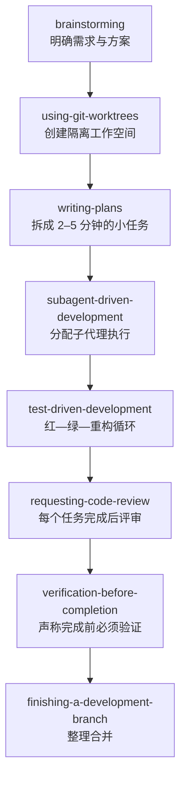
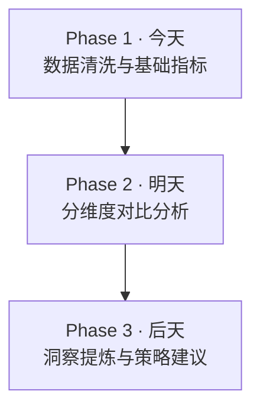
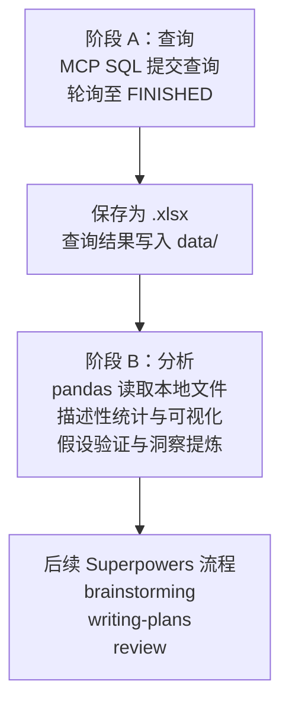
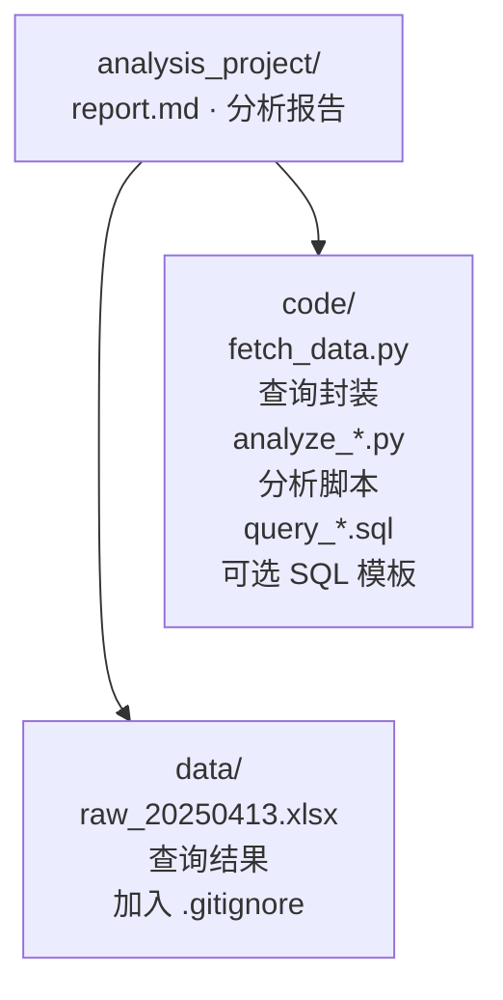

## 一、Superpowers 简介

**[obra/superpowers](https://github.com/obra/superpowers)** 是由 Jesse Vincent 与 Prime Radiant 开发的 **agentic skills framework**。它不是传统代码库，而是一套嵌入 Claude Code、Cursor、Codex、Gemini CLI 等工具的**软件开发方法论**。

核心机制：**14 个可组合 skill**，在任务启动时按关键词自动触发，强制 AI 遵循"先思考、再规划、后执行、最后验证"的完整闭环。

| 类别 | Skills |
|------|--------|
| 思考与规划 | `brainstorming`, `writing-plans`, `using-git-worktrees` |
| 执行与开发 | `subagent-driven-development`, `executing-plans`, `test-driven-development` |
| 调试与验证 | `systematic-debugging`, `verification-before-completion` |
| 协作与收尾 | `requesting-code-review`, `receiving-code-review`, `finishing-a-development-branch` |

你可以把它理解为**给 AI 配备了一套标准化作业程序（SOP）**——每个任务从启动到交付，都要经过特定的检查点和技能触发。

---

## 二、设计哲学：为什么输出质量高

Superpowers 的核心不是"写更好的代码"，而是**"用流程约束对抗认知捷径"**。四条铁律：

1. **Evidence over claims** — 声称完成前，必须先运行测试、读取完整输出、确认一致
2. **Systematic over ad-hoc** — 任何任务开始前，必须先调用对应 skill
3. **Test-Driven Development** — 没有"先看到测试失败"，就不允许写生产代码
4. **Complexity reduction** — 每个任务拆到 2-5 分钟，禁止占位符和过度设计

这个流程的精妙之处：**把质量控制嵌入到每一个环节**，而不是只在最后检查一次。

---

## 三、Superpowers 工作流：从想法到交付



**对分析师的启示**：数据分析也可以建立同样的**分段质量控制流水线**——在拉数据、做模型、写结论的每一步都设置检查点。

---

## 四、数据分析人员的 5 个落地实践

### 实践 1：Brainstorming = 第二大脑

在 Superpowers 里，`brainstorming` 是**硬门槛**。分析师可以要求 Claude 扮演三种角色：

| 角色 | 作用 | 示例 prompt |
|------|------|-------------|
| 盲区探测者 | 列出没想到的维度 | "基于我的想法，列出 3-5 个我可能忽略的变量或风险" |
| 细节确认者 | 追问假设前提 | "对每个假设追问一层——它成立的前提条件是什么？" |
| 反面论证者 | 挑战分析框架 | "如果我是 CEO，我会怎么质疑这个结论？" |

> 示例：当你说"分析降价促销对新用户转化的影响"，AI 应该反问：你如何控制季节性？竞品是否也在促销？"新用户"是注册还是首单？你看的是短期转化还是 LTV？

**分析师最大的风险往往不是算错数，而是问错了问题。**

### 实践 2：TDD = 假设先行

| 要素   | 内容              |
| ---- | --------------- |
| 业务问题 | 我们要回答什么？        |
| 分析假设 | 我预计结果是什么？       |
| 验收标准 | 什么数据能证实/证伪这个假设？ |

> 业务问题：新用户首月留存是否因渠道不同有显著差异？
> 分析假设：organic 渠道留存率高于 paid 至少 10 个百分点。
> 验收标准：按 channel 分组后，30 天留存率的置信区间不重叠。

### 实践 3：Writing-plans = 分阶段交付

不要一次性交付 50 页"终极报告"：



每一阶段都有明确的验收标准。

### 实践 4：Code-review = 自检检查点

| 检查点   | 自检问题                 |
| ----- | -------------------- |
| 数据完整性 | 时间范围完整？有无异常缺失？       |
| 口径一致性 | 指标定义与历史报告一致？         |
| 逻辑一致性 | 细分加总等于总体？百分比约为 100%？ |
| 归因合理性 | 相关关系是否被当成因果关系？       |
| 可执行性  | 建议是否足够具体，业务方能直接落地？   |

### 实践 5：Verification = 验证附录

Superpowers 的 Iron Law：

> **NO COMPLETION CLAIMS WITHOUT FRESH VERIFICATION EVIDENCE**

具体操作：
- 在报告最后一页附上"验证附录"
- 核心数字用至少两道口径交叉验证
- 例如："GMV 同比增长 15%" 同时通过订单表和财务表验证

---

## 五、省钱技巧：把 MCP-SQL 查询与分析解耦

Superpowers 的 workflow 虽然能显著提升质量，但每一步都走完整技能链（brainstorming → planning → subagent → review），**非常消耗 token**。对数据分析师来说，最大的 token 杀手通常是 **MCP SQL 返回的大量原始查询结果**——如果把几千行数据 inline 在对话里，上下文会迅速膨胀，分析阶段还没开始 token 就烧光了。

### 核心思路：查询落盘，分析读盘

把"取数"和"分析"拆成两个独立阶段，让 Superpowers 的后续流程只在"数据摘要/洞察"层面运行。



需要补充数据时，回到阶段 A 重新查询。

### 推荐目录结构



### 脚本模板：`code/fetch_data.py`

```python
import os
import time
import pandas as pd

# 1. 提交 MCP SQL 查询
# （在 Claude Code 中通过 MCP tool 执行，或把 queryId 传入脚本）

# 2. 等待结果
query_id = "your-query-id-from-mcp"
# status = mcp_get_query_status(query_id)
# while status == "RUNNING":
#     time.sleep(3)
#     status = mcp_get_query_status(query_id)

# 3. 获取结果并落盘
# result = mcp_get_query_result(query_id)
# df = pd.DataFrame(result['rows'], columns=[c['name'] for c in result['columns']])

# 4. 保存
output_path = "data/raw_20250413.xlsx"
df.to_excel(output_path, index=False)
print(f"✓ 已保存 {len(df)} 行到 {output_path}")
```

### 在 Superpowers workflow 中的位置

| Superpowers 步骤 | 操作对象 | 说明 |
|------------------|---------|------|
| `brainstorming` | 业务问题 + 假设 | 不涉及 SQL 数据 |
| `writing-plans` | 阶段 A 和阶段 B 的计划 | 明确 "先 query 落盘，再读盘分析" |
| `subagent-driven-dev` | 阶段 A | 只跑 `fetch_data.py`，目标是把数据写进 `data/` |
| **Checkpoint** | 本地文件 | 确认 `data/` 里有文件且行数合理 |
| `subagent-driven-dev` | 阶段 B | 读取本地文件，做统计分析 |
| `verification` | 数据 + 结论 | 检查文件完整性 + 数字交叉验证 |

### 关键注意事项

1. **`data/` 必须加入 `.gitignore`**
   ```
   data/
   ```
2. **每次 query 前确认 `truncated` 字段为 false**。如果为 true，说明结果超过 10,000 行，需要加聚合或分区过滤。
3. **保存一个 `data_summary.txt`**（行数、时间范围、核心指标），方便后续 subagent快速了解情况，而不必打开整个 Excel。
4. **如果 query 可能超时或失败，采用 checkpoint/resume 模式**：先检查本地是否已有文件，有则跳过 query 直接读盘。

---

## 六、在 Claude Code 中使用

### 安装

```
/plugin install superpowers@claude-plugins-official
```

或：

```
/plugin marketplace add obra/superpowers-marketplace
/plugin install superpowers@superpowers-marketplace
```

### 触发词

| 关键词 | 效果 |
|--------|------|
| `tdd` | 进入 TDD 模式 |
| `autopilot` | 全自动模式 |
| `deep interview` | 深度访谈模式 |
| `brainstorming` / `writing-plans` | 规划模式 |

### 非程序员 Prompt 模板

```
我要做一个关于 [主题] 的数据分析。
请遵循以下流程：
1. 先 brainstorming，明确目标、假设、验收标准，并挑战我可能遗漏的维度
2. 然后 writing-plans，拆成 2-3 个可交付阶段
3. 每个阶段完成后 verification，检查数据完整性和逻辑一致性
4. 最后输出带"验证附录"的分析报告
```

---

## 七、总结

| Superpowers 原则 | 分析师版本 |
|------------------|-----------|
| Brainstorming | AI 反诘式头脑风暴，补全盲区 |
| TDD | 假设先行，验证驱动 |
| Writing-plans | 分阶段交付 |
| Code-review | 每阶段自检清单 |
| Verification | 报告附验证附录 |

Superpowers 的本质是**用结构化流程对抗认知惰性**。对策略分析师的价值，不在于写代码更快，而在于让每一次分析都有**清晰的问题定义、可追溯的逻辑链条、以及经得起检验的结论**。

---

*撰写时间：2026-04-13*

## 关联实践

- 看这套协作思路如何用在内容发布：[从 Obsidian 到博客的实际工作流](https://geoqiao.me/blog/publish-obsidian-notes-with-one-command/)，由我审核，再交给 Agent 处理发布。
- 看后来的多 Agent 实践：[我如何使用 Paseo](https://geoqiao.me/blog/how-i-use-paseo/)，把目标讨论、任务分工与最后验收放进日常操作。
- 如果还需要评估模型预算：读[AI 编程订阅的额度与成本对比](https://geoqiao.me/blog/ai-coding-subscriptions-api-value-comparison/)，不要把跑满额度的估算当成每个人都能获得的成本。
