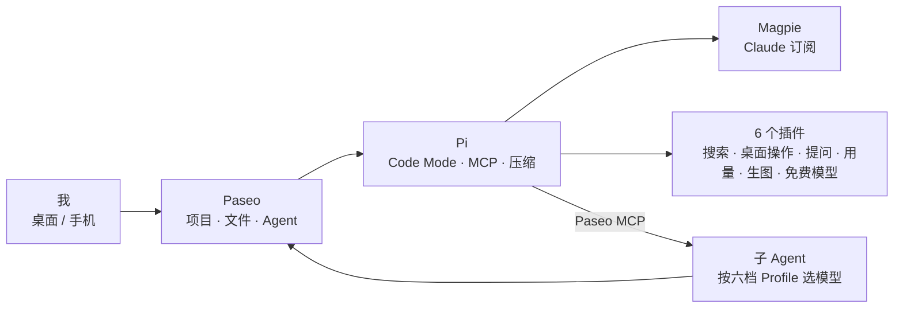

> 损之又损，以至于无为。——《道德经》第四十八章（[原文](https://zh.wikisource.org/zh-hant/道德經_(王弼本))）

8 月我写过一篇 [What's on My Pi Agent?](https://geoqiao.me/blog/terminal-codex-workflow-with-pi-and-herdr/)，用 Pi + Herdr + Neovim 在终端里搭了一套 Codex Desktop。两个月过去，那篇文章列的 8 个 Pi 插件里，只有 `pi-web-access` 还装着。

现在的组合是 **Paseo + Pi + Claude + 6 个插件**，完整清单在文章末尾：

- **Paseo** 管工作台：项目、文件、多个 Agent，还有手机接管。
- **Pi** 管 Agent：模型循环、工具调用、会话，Code Mode、MCP 和压缩都已内置。
- **Claude** 是主力模型，订阅通过 Magpie 接进 Pi。
- **插件** 只补 Pi 和 Paseo 都没有的能力。



## 两个月，换了什么

这是我 2026 年 10 月 1 日的配置，Pi 0.99.2、Paseo 0.11.0-beta.2。

| 要做的事 | 8 月 | 现在 |
| --- | --- | --- |
| 工作台 | Herdr | Paseo |
| 看代码、改代码 | Neovim + `pi-nvim` | Paseo 的文件面板 |
| 主力模型 | GPT（Codex 订阅） | Claude（Max 5×，经 Magpie） |
| Subagent | `pi-subagents` | Paseo Profile + Paseo MCP |
| Code Mode | 没有 | Pi 内置 `codemode` |
| MCP | `pi-mcp-adapter` | Pi 内置 MCP |
| 长会话压缩 | `pi-codex-compaction` | Pi 自带 compaction |
| Computer Use | `pi-computer-use` | `codex-computer-use-mcp` |
| 搜索和读网页 | `pi-web-access` | `pi-web-access` |
| Side Chat | `pi-herdr-btw` | Paseo 新建 Tab |
| Goal | `pi-goal` | 很少用了 |

## 1. 工作台：Paseo 接手了 Herdr 和 Neovim

[Paseo](https://paseo.sh/) 把项目、文件和多个 Agent 放进一个窗口，手机上也能接着干活。8 月要靠 Herdr 的 pane 布局和 `pi-nvim` 自己拼出来的工作台，现在是现成的。选它的过程写在[这篇对比](https://geoqiao.me/blog/agent-orchestrator-desktop-selection/)里，日常用法写在[codex 旧王死，Paseo 新王立](https://geoqiao.me/blog/how-i-use-paseo/)里。

## 2. 模型：主力从 GPT 换成了 Claude

Claude 订阅是通过 [Magpie](https://usemagpie.ai)（作者 [@yetone](https://x.com/yetone)）接进 Pi 的：它在本机起一个网关，后台启动真正的 Claude Code 代发请求，Pi 的工具以 MCP 形式交给它，Pi 这边只是多了一个 provider。

换的理由有两个：

- **成本**：ChatGPT Pro 20× 没有以前耐用。9 月 13 日我 30 小时就用掉了周额度的 54%，当时还[在推上问过](https://x.com/geoqiao/status/2099137966312743385)是不是 20× 变成了 10×。GPT 吐字也慢，同一个任务里 Astra 每秒约 30 个输出 token，Sol 6.1 约 20，Opus 5.5 是 88 到 104。
- **能力**：在我看来，Claude 5.5 系列几乎是目前最强的 frontier 模型。[同一个任务](https://x.com/geoqiao/status/2104889456675455463)里，Opus 5.5 比 Opus 5 少用 20% 的 token，Sonnet 5.5 比 Sonnet 5 少用 58%，因为它们一次请求做的动作更多。前端排版也比 GPT 整齐。

我手上同时有 Claude Max 5× 和 ChatGPT Pro 20×，按 10 月 1 日晚的剩余额度和本机日志粗算了一下：

| | Claude Max 5× | ChatGPT Pro 20× |
| --- | --- | --- |
| 月费 | $100 | $200 |
| 本周额度已用 | 61% | 35% |
| 对应的 API 等价用量 | 约 $580 | 约 $340 |
| 推算一周满额 | 约 $950 | 约 $970 |
| 每 1 美元月费对应的周额度 | 约 $9.5 | 约 $4.8 |

## 3. Pi 内置能力：Code Mode、MCP 和压缩不用再装插件

这几项能力之前都靠插件提供。Pi 0.99.0（9 月 29 日）把 Code Mode、Tool Search 和 MCP 做成了内置扩展，我第二天就卸掉了 `pi-codex-conversion` 和 `pi-mcp-adapter`，改用 Pi 原生的 `codemode`。

| 能力 | 8 月 | 9 月 | 现在 |
| --- | --- | --- | --- |
| Code Mode | 没有 | `pi-codex-conversion` 的 Notebook Mode | 内置 `codemode`，`mode: "only"` |
| MCP | `pi-mcp-adapter` | `pi-mcp-adapter` | 内置 MCP，服务按 `codemode` 方式暴露 |
| 长会话压缩 | `pi-codex-compaction` | `pi-codex-conversion` 的原生 Responses 压缩 | Pi 自带 compaction |

`mode: "only"` 的意思是模型只看到一个 `codemode` 工具，读文件、跑命令、调 MCP 都写在一段 JavaScript 里，一次往返做完。

```json
{
  "defaultTools": ["read", "bash", "edit", "write", "codemode"],
  "codemode": { "mode": "only" }
}
```

9 月的[长任务实验](https://geoqiao.me/blog/is-code-mode-the-future/)里，Code Mode 让累计 token 少了 75%，估算费用降了 64%，那次用的还是插件。内置版本我在 9 月 30 日[补测了一次](https://x.com/geoqiao/status/2105260301818249333)，任务是为博客设计并实现一套新主题：

| 模型 | 配置 | 请求数 | Token（含缓存） | API 等价费用 |
| --- | --- | --- | --- | --- |
| GPT-6 Astra | Pi，直接调用工具 | 79 | 10.20M | $14.52 |
| GPT-6 Astra | Pi，内置 CodeMode-only | 44 | 5.19M | $9.13 |
| GPT-6 Astra | Codex CLI，原生 Code Mode | 60 | 7.65M | $11.82 |
| Opus 5.5 | Claude Code，直接调用工具 | 98 | 12.66M | $8.14 |
| Opus 5.5 | Pi + Magpie，内置 CodeMode-only | 68 | 11.16M | ≥ $6.33 |

## 4. Subagent：六档模型分工

子 Agent 不再由 Pi 插件启动，而是 Pi 通过 Paseo 的 MCP 创建，创建时按 Profile 选模型和推理档位。Paseo 原本靠 `pi-mcp-adapter` 注入这个 MCP，我写了一个 30 行的本地扩展，把它注册到 Pi 的内置 MCP 上。

| Profile | 模型与推理档位 | 交给它什么 |
| --- | --- | --- |
| 默认 | Claude Sonnet 5.5 · High | 日常交互、澄清需求、拆任务，小任务直接做 |
| 复杂方案讨论 | Claude Opus 5.5 · High | 只读调查，比较方案，给出实现边界和验收标准 |
| 复杂实现 | Claude Opus 5.5 · XHigh | 有具体技术难点的调查、实现和验证 |
| 快速执行 | Claude Sonnet 5.5 · High | 范围和验收标准明确的编码、修复、测试 |
| 只读整理 | Claude Sonnet 5.5 · High | 查代码、收集资料、读日志 |
| 三方建议 | GPT-6 Astra · XHigh | 有实质争议或高风险变更前，独立核验 |

和 [9 月那套](https://geoqiao.me/blog/pi-codex-paseo-workflow/)相比，Luna 完全禁用：Luna Max 吐字慢，经常花几十分钟纠结一个简单任务，相比 Sonnet 5.5 基本处于不可用的状态。

主模型不可用时，先换 GPT-6.1 Sol。只读整理和三方建议这两档还能再退到 OpenCode 的免费模型，但私有代码和内部文档只交给零保留、不用于训练的那几个。

## 5. 还装着的 6 个插件

| 要做的事 | 插件 | 我选择的理由 |
| --- | --- | --- |
| 搜索和读网页 | [pi-web-access](https://github.com/nicobailon/pi-web-access) | 8 月那批插件里唯一留下来的 |
| 操作 macOS 应用 | [codex-computer-use-mcp](https://github.com/tmustier/codex-computer-use-mcp) | 在后台操作，不抢我正在用的窗口 |
| 让 Agent 向我提问 | [pi-ask](https://github.com/geoqiao/pi-tools/tree/main/packages/pi-ask) | 关键问题变成选项，在 Paseo 里逐题作答 |
| 看 Token 用在哪 | [pi-usage](https://github.com/geoqiao/pi-tools/tree/main/packages/pi-usage) | 纯本地统计各 harness、模型、项目的用量 |
| 生图 | [pi-codex-image-gen](https://github.com/jvm/pi-mono/tree/main/packages/pi-codex-image-gen) | 文章封面直接在 Pi 里生成 |
| 免费备用模型 | [pi-opencode-free](https://github.com/geoqiao/pi-tools/tree/main/packages/pi-opencode-free) | 把 OpenCode 的免费模型接成 Pi 的 provider，只做只读任务的备用 |

`pi-ask`、`pi-usage` 和 `pi-opencode-free` 是我自己在维护的。

## 6. 不再需要的：Side Chat 和 Goal

Side Chat 是个伪需求：想旁路问一句，在 Paseo 里新建一个 Tab 就行，不必依赖插件。

Goal 我最近很少用了。模型能力越来越强，长 Goal 跑起来还容易目标偏移。

## 完整清单

按顺序装下来就是我现在的配置；登录、macOS 权限和各插件的细节见项目链接。

**1. 工作台和 Agent**

| 装什么 | 怎么装 |
| --- | --- |
| [Paseo](https://paseo.sh/) 桌面端 | 从 [paseo.sh/download](https://paseo.sh/download) 下载，打开后 daemon 自动启动 |
| Paseo 手机端 | 桌面端 **Settings → 你的 host → Pair Device** 扫码配对 |
| [Pi](https://github.com/earendil-works/pi) | `npm install -g --ignore-scripts @earendil-works/pi-coding-agent` |
| [Magpie](https://usemagpie.ai) | `curl -fsSL https://usemagpie.ai/install.sh \| sh`，或从官网下载 |

**2. Pi 插件**

```bash
pi install npm:pi-web-access
pi install npm:codex-computer-use-mcp
pi install npm:@geoqiao/pi-ask
pi install npm:@geoqiao/pi-usage
pi install npm:pi-codex-image-gen
pi install npm:@geoqiao/pi-opencode-free
```

Code Mode 不用装，按第 3 节的配置在 Pi 的 `settings.json` 里打开。

**3. Skills**

| Skill | 用途 | 怎么装 |
| --- | --- | --- |
| [playwright-cli](https://github.com/microsoft/playwright-cli) | 浏览器自动化，9 月用的 `agent-browser` 已经不在了 | `npm install -g @playwright/cli@latest`，再 `playwright-cli install --skills` |
| [agent-reach](https://github.com/Panniantong/Agent-Reach) | 读取 X、B 站等平台内容 | 见项目的安装说明 |
| `prototype` | 原型设计 | Matt 系列 Skills 里我唯一保留的 |
| `paseo` / `paseo-help` / `paseo-plugin` / `paseo-advisor` / `paseo-committee` / `paseo-handoff` | 操作和了解 Paseo | Paseo 自带 |

**4. Paseo 插件**

Paseo 插件是不受沙箱限制的代码，装之前先读各自的 README。

| 插件 | 用途 | 怎么装 |
| --- | --- | --- |
| [DeepSeek Harness](https://github.com/geoqiao/paseo-stuff/tree/main/plugins/deepseek-harness) | 通过官方 ACP 接口把 DeepSeek Harness 接入 Paseo | `paseo plugin add geoqiao/paseo-stuff:plugins/deepseek-harness --ref deepseek-harness-v0.1.0-beta.10` |
| [Math Renderer](https://github.com/geoqiao/paseo-stuff/tree/main/plugins/math-renderer) | 回复完成后渲染块级 LaTeX 公式 | `paseo plugin add geoqiao/paseo-stuff:plugins/math-renderer --ref math-renderer-v0.1.0-beta.4` |
