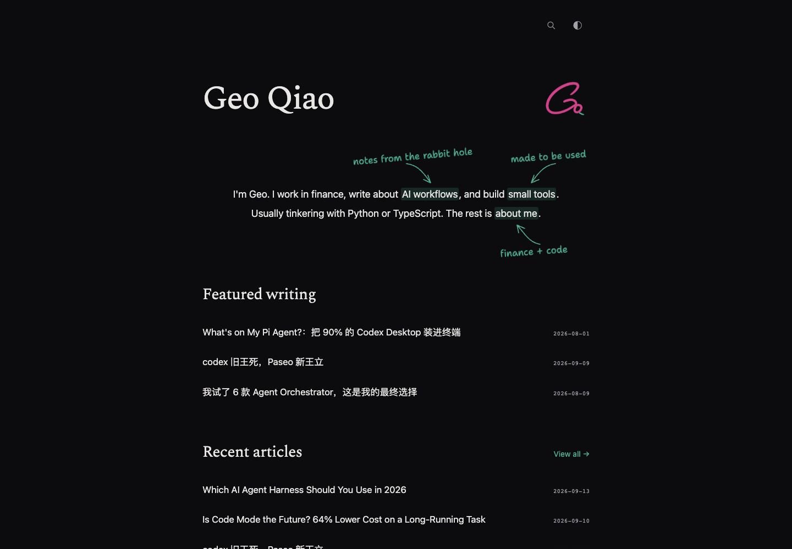
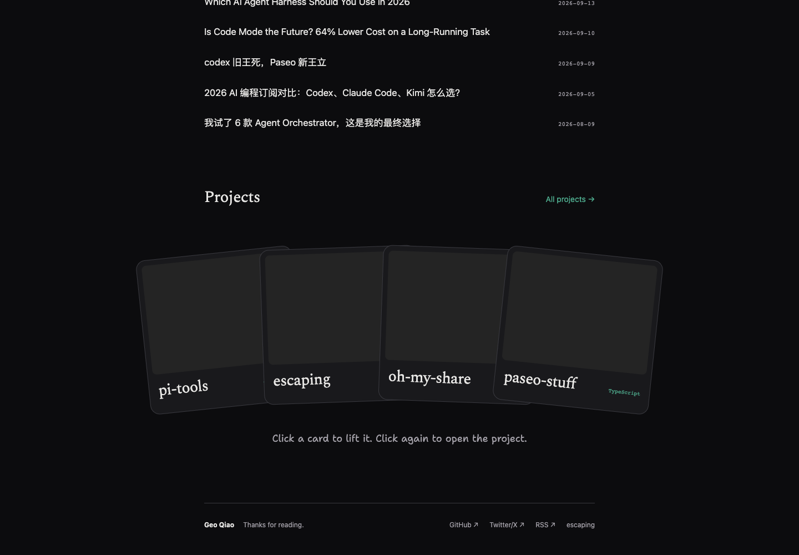
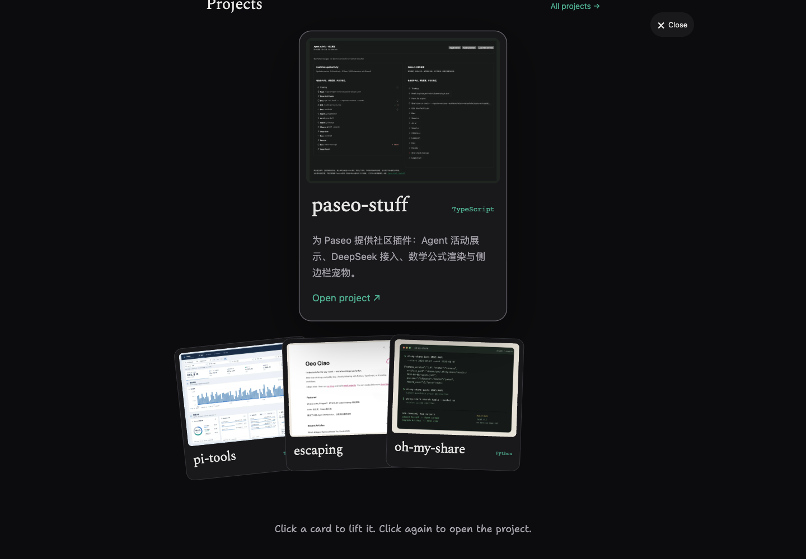
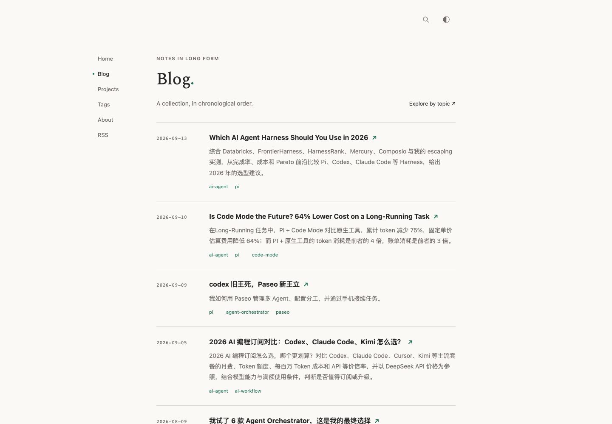
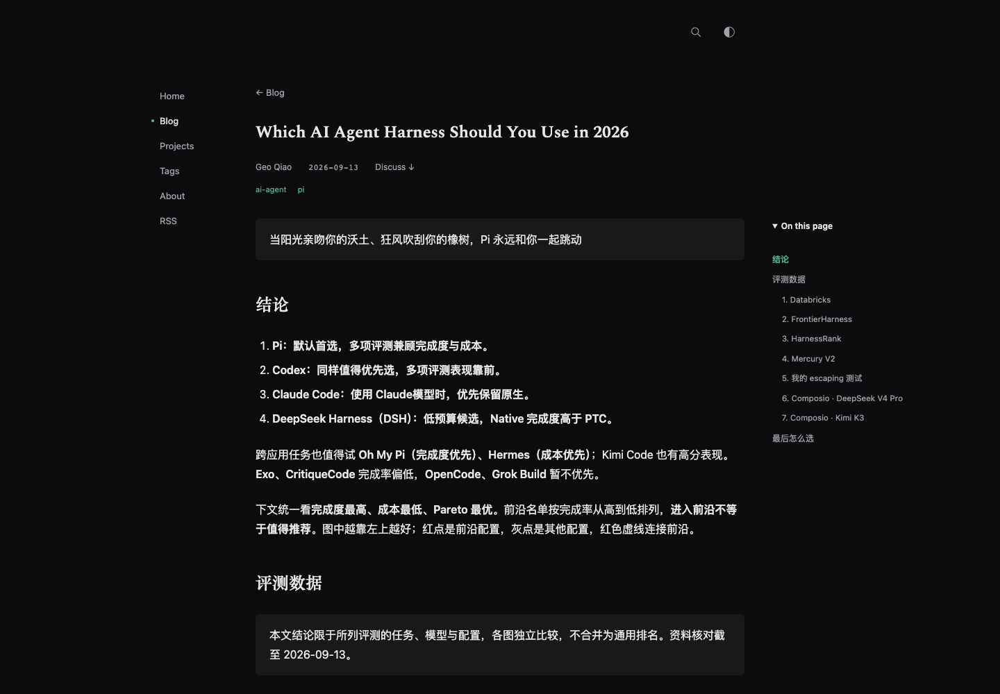
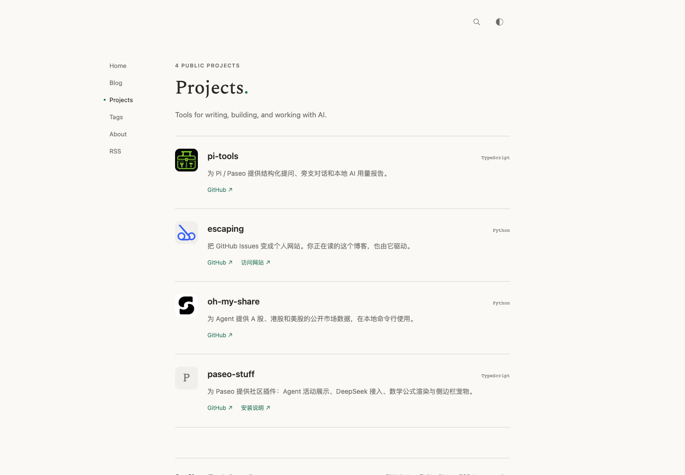
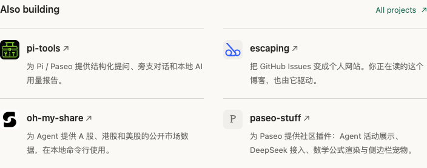
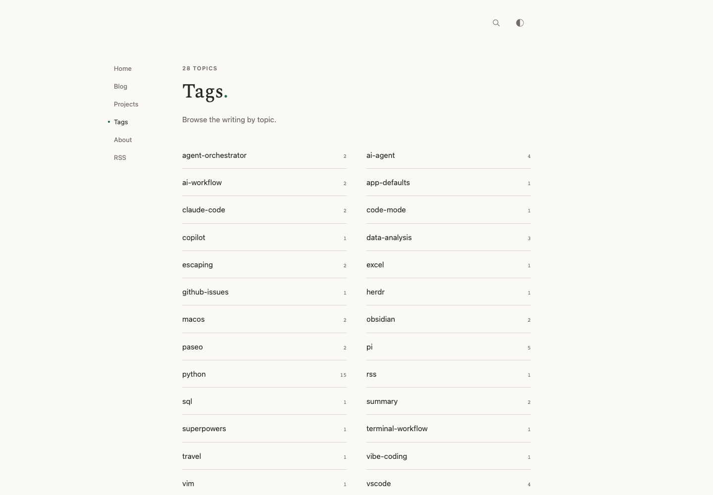

# Geo local preview

Geo is the site's independent theme, initially based on Quiet. It owns its templates, assets, and interaction code and does not track future Quiet changes. Quiet remains escaping's built-in default.

This preview was prepared on `design/geo-theme` on 2026-09-14. It is local only; no public deployment was performed.

## Try it

Run `bash scripts/preview_geo.sh` from the repository, then open <http://localhost:8765>. See the [theme guide](../theme/README.md) for requirements, rebuilding, and implementation details.

- On a wide desktop, click a project card to lift it, then click again to open its project. Click another card to switch; Close, Escape, or clicking outside dismisses the preview.
- The introduction has drawn arrows, handwritten notes, and animated link highlights.
- Narrow screens show a swipeable row with direct links. Reduced motion uses a static grid. Links and descriptions also work without JavaScript.
- Light and dark appearance, search, project pages, article pages, and existing content routes are retained.
- Projects uses small logos, text descriptions, and explicit links. About uses a compact version of the same component. Tags is an alphabetical text index with article counts.
- The UI uses a consistent profile-inspired green for links, tags, active markers, and handwritten notes: deep green in light mode and softer green in dark mode.
- Inner pages use a fixed, narrow list of muted text links in the left margin, with a small dot marking the current section. Search and appearance remain at the top, matching Home's position. On smaller screens, a Menu control at the top left opens the links; the compact header stays available while scrolling.

## Captured preview

These screenshots show the actual locally generated site:

[Mobile homepage screenshot](images/geo-home-mobile.png)

The revised inner-page navigation:

[Dark appearance](images/geo-blog-header-dark.png) · [Mobile header](images/geo-blog-header-mobile.png)

[Open mobile navigation](images/geo-mobile-navigation-open.png)

The project and topic catalogs:

[Dark Projects](images/geo-projects-dark.png) · [Mobile Projects](images/geo-projects-mobile.png) · [Mobile Tags](images/geo-tags-mobile.png)

## Validation

- Generated the real Issues-backed site with the production-pinned escaping compiler, `9b16dbbea2dd2dd2a38e742198b0f7300f0404eb`.
- Generated and validated all 31 legacy slug redirects.
- Passed all 18 existing site tests.
- Passed all five browser cases during layout verification in full Chromium and WebKit: project selection/navigation, modifier links, keyboard controls, reinitialization, resizing, mobile/reduced-motion layouts, script fallbacks, search, and persisted appearance.
- Checked desktop and mobile screenshots, intermediate widths, image loading, JavaScript/shell syntax, and whitespace errors.
- After the palette revision, rebuilt the site and checked computed accent colors in both modes, all handwritten notes, system appearance without JavaScript, and black print accents. Refreshed desktop/mobile screenshots. Accent contrast is 5.74:1 on the light canvas, 5.27:1 on light panels, 7.32:1 on the dark canvas, and 6.57:1 on dark panels; highlighted annotation hover text remains at least 4.52:1.
- After the catalog revision, all 18 site tests and both five-case browser suites passed. Projects, Tags, About, and the Python archive fit at seven widths from 320 to 1440px. All 28 tag links returned a page whose article count matched the index. Checked all logo images, About's heading hierarchy, and the homepage's four screenshot-cover URLs.
- After the left-navigation revision, reran all 18 site tests and both five-case browser suites. Checked Home, Blog, Projects, Tags, and About at 320, 390, 768, 1080, 1081, and 1440px: control positions match, the desktop navigation stays outside the reading column, and no document overflow occurs. Scoped Chromium/WebKit checks covered keyboard traversal, Escape, focus across breakpoints, page switching, and usable navigation with JavaScript disabled or the site script blocked. WebKit's native Option-Tab behavior was used to traverse links on macOS.
- A separate review found no actionable reproducible problems. It also checked scroll interruption and changing motion preferences interactively; these edge cases are not fully asserted by the automated suite.

Project artwork is local and documented in [cover provenance](theme-covers.md) and [logo provenance](theme-logos.md). No Kieran custom source or artwork was copied.
